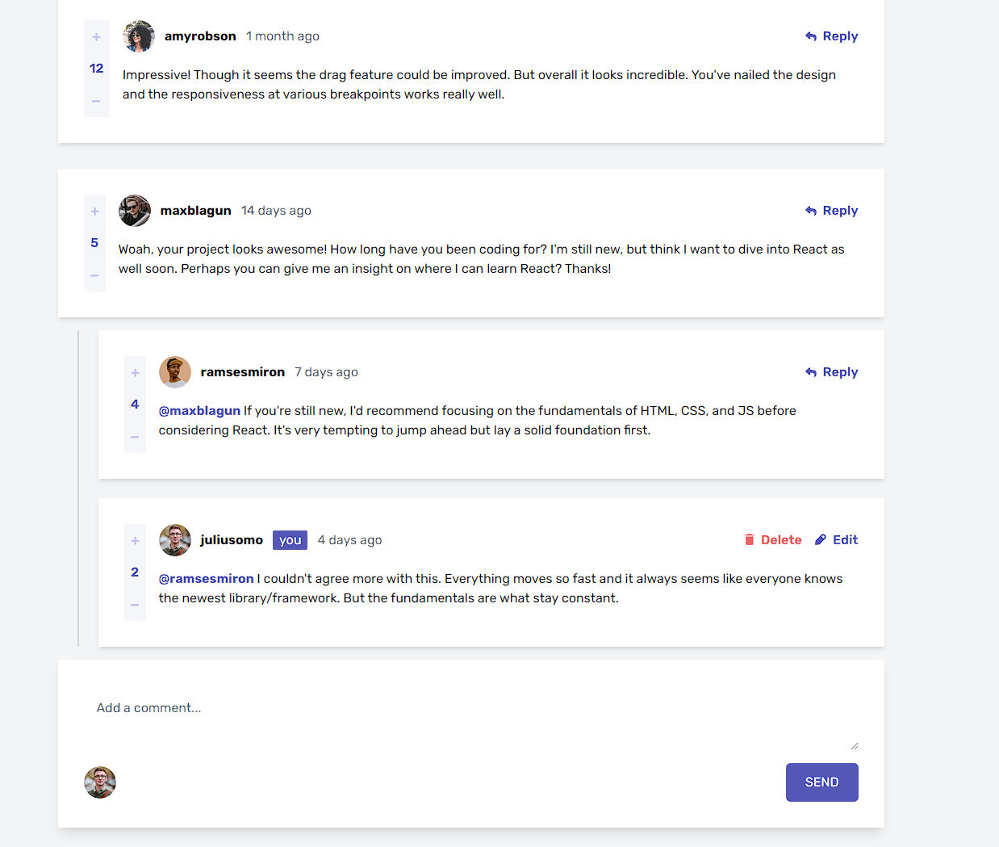
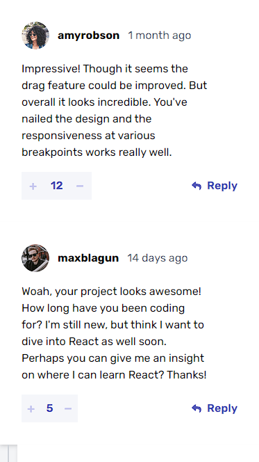

# Frontend Mentor - Interactive Comments Section solution

This is a solution to the [Interactive Comments Section challenge on Frontend Mentor](https://www.frontendmentor.io/challenges/results-summary-component-CE_K6s0maV). Frontend Mentor challenges help you improve your coding skills by building realistic projects.

## Table of contents

- [Frontend Mentor - Interactive Comments Section solution](#frontend-mentor---interactive-comments-section-solution)
  - [Table of contents](#table-of-contents)
  - [Overview](#overview)
    - [The challenge](#the-challenge)
    - [Screenshot](#screenshot)
      - [Desktop](#desktop)
      - [Mobile](#mobile)
    - [Links](#links)
  - [My process](#my-process)
    - [Built with](#built-with)
    - [What I learned](#what-i-learned)
    - [Useful resources](#useful-resources)

## Overview

### The challenge

Users should be able to:

- View the optimal layout for the app depending on their device's screen size
- See hover states for all interactive elements on the page
- Create, Read, Update, and Delete comments and replies
- Upvote and downvote comments
- **Bonus**: If you're building a purely front-end project, use `localStorage` to save the current state in the browser that persists when the browser is refreshed.
- **Bonus**: Instead of using the `createdAt` strings from the `data.json` file, try using timestamps and dynamically track the time since the comment or reply was posted.

### Screenshot
#### Desktop

#### Mobile

### Links

- Live Site URL: [Github Pages](https://jaimayal.github.io/interactive-comments-section/)

## My process

### Built with

- JSX markup
- Flexbox
- CSS Grid
- Mobile-first workflow
- [Astro](https://astro.build/) - All-in-one framework
- [React](https://react.dev/) - Frontend framework
- [Tailwind](https://tailwindcss.com/) - CSS framework
- [Nanostores](https://github.com/nanostores/nanostores) - State management library

### What I learned

I've learned a lot more about Astro, its not really great when it comes to web apps. I learned on how to integrate other frameworks and libraries with Astro (Like Tailwind, React and Nano stores).

### Useful resources

- [Astro docs](https://docs.astro.build/en/getting-started/) - The official documentation of Astro is very complete and easy to understand. The best resource if you're looking to learn Astro by far.
- [React docs](https://react.dev/learn)
- [Tailwind docs](https://v2.tailwindcss.com/docs)